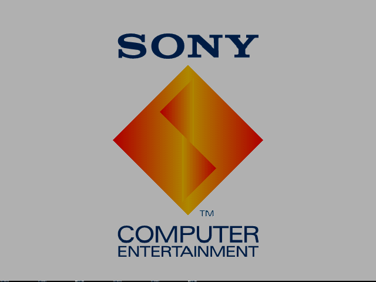

# Liam's Native Emulators

From-scratch, **natively-compiled** console emulators in Rust — no browser/WASM layer and no SDL or
other C media library to link (window, framebuffer, and input all come from the pure-Rust
[`minifb`](https://crates.io/crates/minifb) crate). Each emulator is a standalone Cargo crate, written
**clean-room** from primary hardware documentation and hardware test ROMs, and licensed permissively
(MIT) — independent code, free to embed.

The centerpiece is a **PlayStation 1** emulator that boots a real PS1 BIOS to its on-screen logo:

  

> *The Sony Computer Entertainment boot screen, rendered from scratch — the BIOS's own GPU draw lists,
> run over an emulated MIPS R3000A + GPU + DMA, with no game or CD-ROM.*

## The emulators

### PlayStation 1 — [`psx/`](psx/README.md) · the flagship, in active development

A MIPS R3000A console emulator built clean-room from the Nocash psx-spx spec and the JaCzekanski
`ps1-tests` suite. It boots the real BIOS (passing the `cpu/cop` hardware test through a serial/TTY
harness), runs PS-EXE programs, and has a **complete GPU**: DMA-fed command lists, a software
rasterizer (flat/Gouraud/textured polygons, sprites, lines, semi-transparency — validated
**pixel-exact** against the suite's reference frames), and ~60 Hz VBlank timing driving an on-screen
window. The GTE (3D geometry), CD-ROM, and SPU audio are the road ahead.

### Game Boy (DMG) — [`gameboy/`](gameboy/README.md) · complete

Boots and plays Tetris. Full Sharp SM83 CPU (passes Blargg's `cpu_instrs` and `instr_timing`), the
hardware timer and interrupts, cartridge loading (no-MBC + MBC1 banking), a scanline PPU with
background / window / sprites (passes `dmg-acid2`), and keyboard-driven joypad input.

### CHIP-8 — [`chip8/`](chip8/README.md) · complete · the warm-up

A complete CHIP-8 interpreter — all 35 opcodes, the 64×32 XOR-sprite display, the 60 Hz delay/sound
timers, and the 16-key hex keypad. The on-ramp that established the from-scratch, test-ROM-driven
approach the later cores scaled up.

## Approach

- **Native and from-scratch.** No emulation framework, no libretro — the CPU, GPU, and timing are
  written directly, the way you'd want a core that has to run *fast*.
- **Correctness before features.** Every core is validated headlessly against hardware test ROMs
  (Blargg for the Game Boy, JaCzekanski `ps1-tests` for the PS1) and golden-file frame diffs before
  anything is called done.
- **Clean-room + permissive.** Behaviour is derived from primary hardware docs and test ROMs, not from
  existing (mostly GPL) emulators — so the code is independently authored and MIT-licensed.

## Building & running

Each emulator is its own crate; build from inside its directory with `cargo build --release`, and see
that crate's README for run modes, controls, and where to put ROMs:

[`psx/README.md`](psx/README.md) · [`gameboy/README.md`](gameboy/README.md) · [`chip8/README.md`](chip8/README.md)

Requires [Rust](https://www.rust-lang.org/tools/install) (stable, 2024 edition); `cargo` fetches
`minifb` on the first build. ROMs and BIOS images are **not** included — the `roms/` and `bios/`
folders are git-ignored, so supply your own locally.

## License

MIT — see [LICENSE](LICENSE).
